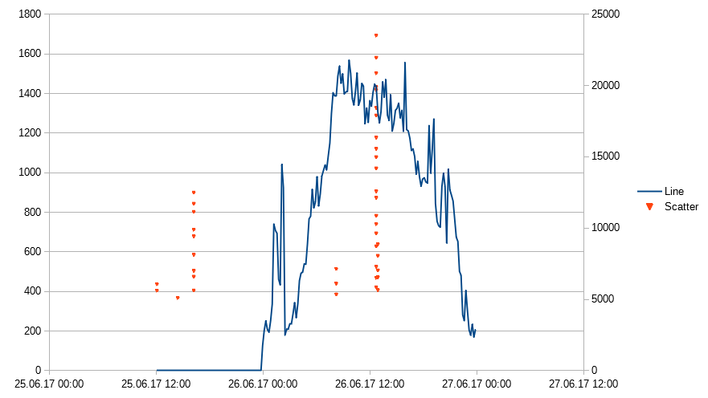

# Massive Log Compresser

A script that compresses massive preprocessed log outputs so that they can be safely viewed in an ordinary spreadsheet application.

## Getting Started

These instructions will get you a copy of the project up and running on your local machine for development and testing purposes. See deployment for notes on how to deploy the project on a live system.

### Prerequisites

This script runs on [Node.js](https://nodejs.org/en/) from version 5.X onwards.

### Installing

Clone or download the project.

```
git clone https://github.com/Ohems/mlc.git
```

Move into the project folder.

```
cd mlc
```

Install dependencies.

```
npm install
```

## Running the example

Run the example script. You can pipe it to a file by adding ` > output.txt` to the end of the command

```
npm run --silent example
```

Copy the output to a spreadsheet software, separating rows by newline and columns by space. After graphing, the output should look something like this:



## Running the tests

This project doesn't have unit tests yet.

### Coding style tests

Code style is tested using [ESLint](http://eslint.org/).

```
npm run eslint
```

## Running the script

Script parameters are

```
node index.js x_resolution y_resolution [[filepath graph_type]...]
```

where `graph_type` can be one of
* `line_sum` Line, sum values together
* `line_avg` Line, calculate average value
* `scatter` Scatter

Input data must be in the format

```
x_value [y_value...]
x_value [y_value...]
x_value [y_value...]
```

The amount of values must be constant throughout the entire input file and values must be separated with a space. If no `y_value` is defined, a default value of 1 is used.

Values can be floating point numbers or dates. All formats listed [here](https://momentjs.com/docs/#/parsing/string/) work, excluding those that contain a space.

## Contributing

Please read [CONTRIBUTING.md](CONTRIBUTING.md) for details on our code of conduct, and the process for submitting pull requests to us.

## Versioning

We use [SemVer](http://semver.org/) for versioning. For the versions available, see the [tags on this repository](https://github.com/Ohems/mlc/releases).

## Authors

* [Ohems](https://github.com/Ohems) - *Initial work*

See also the list of [contributors](https://github.com/Ohems/mlc/graphs/contributors) who participated in this project.

## License

This project is licensed under the MIT License - see the [LICENSE.md](LICENSE.md) file for details
